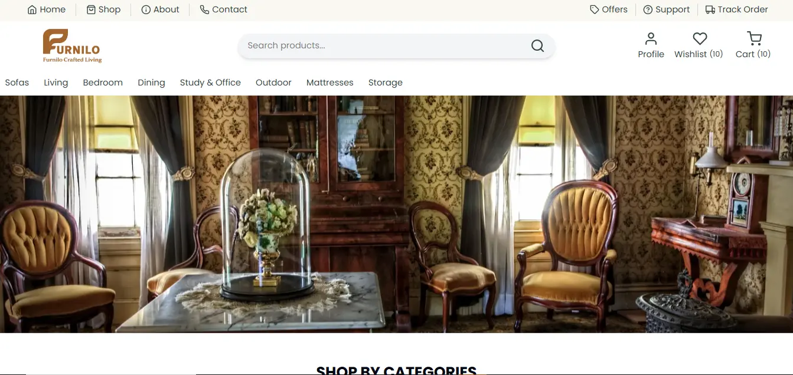
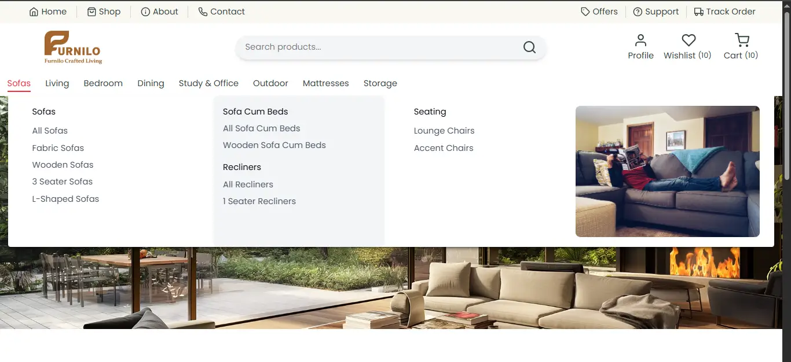
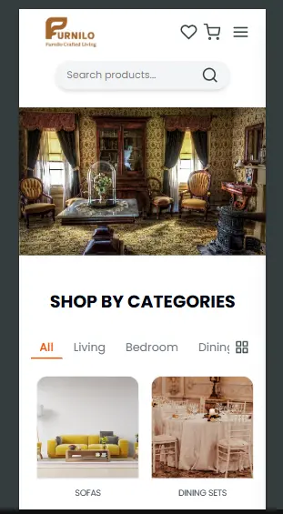
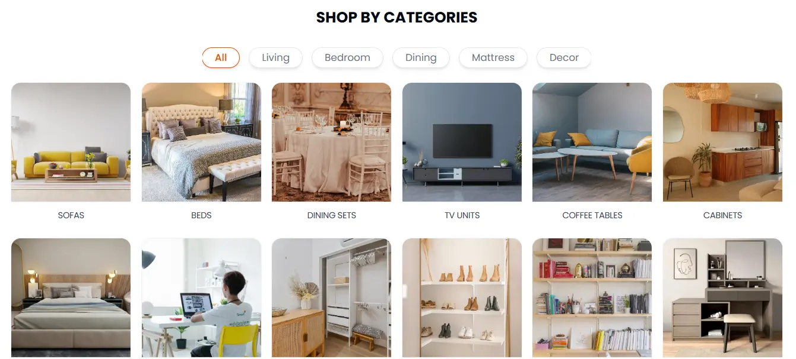

# FURNILO - Modern E-Commerce Furniture Website

FURNILO is a modern and responsive furniture e-commerce web application built using **React.js**, **Vite**, and **Tailwind CSS**.  
The project focuses on creating a clean UI/UX inspired by modern furniture platforms with category-based product browsing, responsive layouts, animations, and scalable frontend architecture.

---

## 🔗 Important Links

🌐 Live Site: https://furnilo.vercel.app/
💻 GitHub Profile: https://github.com/maganstackforge
📂 Project Repository: https://github.com/maganstackforge/furnilo.com
👤 LinkedIn: https://linkedin.com/in/maganstackforge
📧 Email: magan.stackforge@gmail.com

---

## 📂 Project Structure

```bash
FURNILO_APP
│
├── public
├── src
│   ├── assets
│   ├── components
│   ├── Config
│   ├── context
│   ├── data
│   ├── icons
│   ├── pages
│   ├── utils
│   ├── App.css
│   ├── App.jsx
│   ├── index.css
│   └── main.jsx
│
├── .gitignore
├── eslint.config.js
├── furnilo.json
├── index.html
├── package.json
├── tailwind.config.js
├── vite.config.js
└── README.md
```

✨ Features
• Modern responsive UI
• Furniture product categories
• Dynamic routing using React Router
• Mobile responsive mega menu
• Product filtering structure
• Reusable component architecture
• Smooth animations with Framer Motion
• SEO support using React Helmet Async
• Swiper.js product sliders
• Scalable folder structure
• Optimized frontend performance
• Tailwind CSS utility-first styling

🛠️ Tech Stack

Frontend:
• React.js
• Vite
• Tailwind CSS

Routing:
• React Router DOM

Animation:
• Framer Motion

UI Libraries:
• Swiper.js
• Lucide React
• React Icons
• Heroicons
• Iconify

✨ Development Tools
• ESLint
• Prettier
• Vite

📦 Installation

Clone the repository:

git clone https://github.com/Maganstackforge/furnilo.com.git

Move into the project directory:

cd furnilo

Install dependencies:

npm install

Start development server:

npm run dev

Build for production:

npm run build

Preview production build:

npm run preview

📱 Responsive Design

The application is fully responsive and optimized for:

• Mobile Devices
• Tablets
• Laptops
• Desktop Screens

🎯 Learning Outcomes

This project helped improve skills in:

• React component architecture
• State management concepts
• Dynamic UI rendering
• Responsive web design
• Folder structure organization
• Routing in React
• Frontend optimization
• Tailwind CSS workflow

📸 Screenshots

Add your screenshots here.






🔮 Future Improvements

• Shopping cart functionality
• Wishlist system
• Authentication & authorization
• Backend integration
• Payment gateway
• Product search
• Pagination
• Dark mode

👨‍💻 Author

Magan Singh
Frontend Developer Intern @ Namrata Universal  
MCA Graduate | React.js | JavaScript | Node.js (Learning)

📄 License

This project was developed for learning, frontend architecture practice, and portfolio demonstration purposes.
